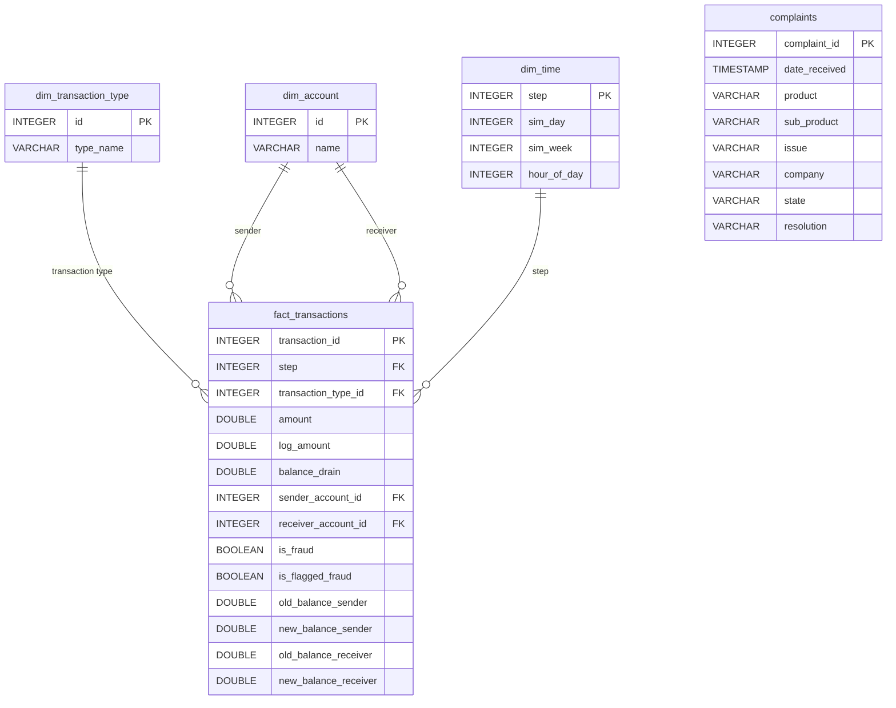

# Schema Diagram

```mermaid
erDiagram

    dim_transaction_type {
        INTEGER id PK
        VARCHAR type_name
    }

    dim_account {
        INTEGER id PK
        VARCHAR name
    }

    dim_time {
        INTEGER step PK
        INTEGER sim_day
        INTEGER sim_week
        INTEGER hour_of_day
    }

    complaints {
        INTEGER complaint_id PK
        TIMESTAMP date_received
        VARCHAR product
        VARCHAR sub_product
        VARCHAR issue
        VARCHAR company
        VARCHAR state
        VARCHAR resolution
    }

    fact_transactions {
        INTEGER transaction_id PK
        INTEGER step FK
        INTEGER transaction_type_id FK
        DOUBLE amount
        DOUBLE log_amount
        DOUBLE balance_drain
        INTEGER sender_account_id FK
        INTEGER receiver_account_id FK
        BOOLEAN is_fraud
        BOOLEAN is_flagged_fraud
        DOUBLE old_balance_sender
        DOUBLE new_balance_sender
        DOUBLE old_balance_receiver
        DOUBLE new_balance_receiver
    }

    dim_transaction_type ||--o{ fact_transactions : "transaction type"
    dim_account ||--o{ fact_transactions : "sender"
    dim_account ||--o{ fact_transactions : "receiver"
    dim_time ||--o{ fact_transactions : "step"
```